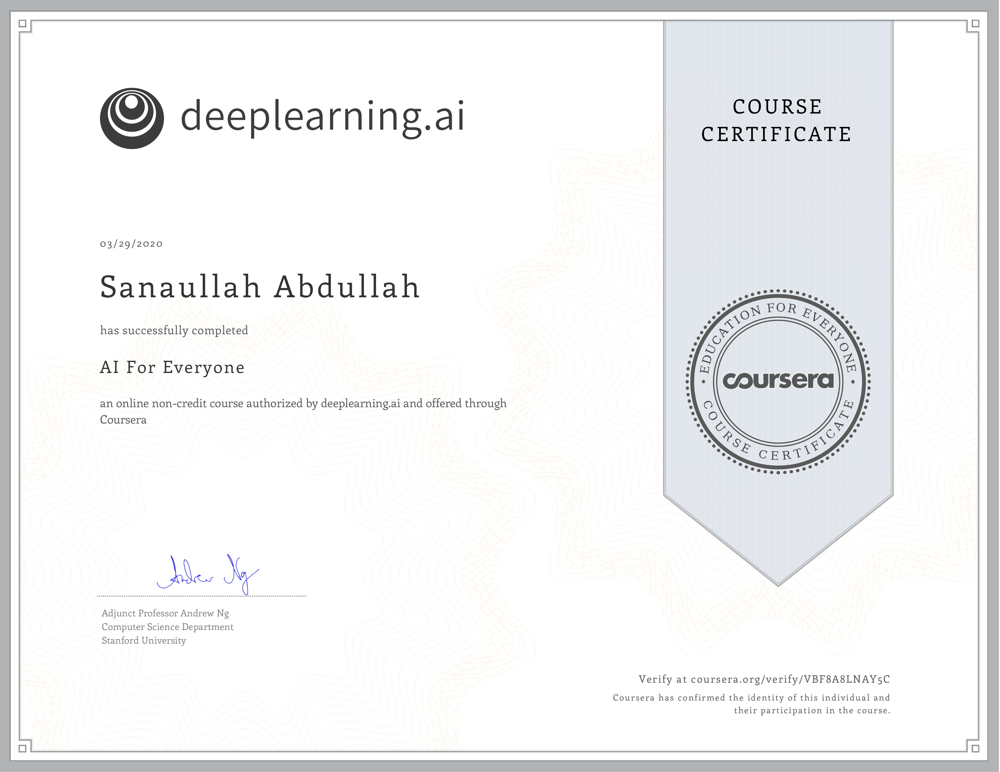
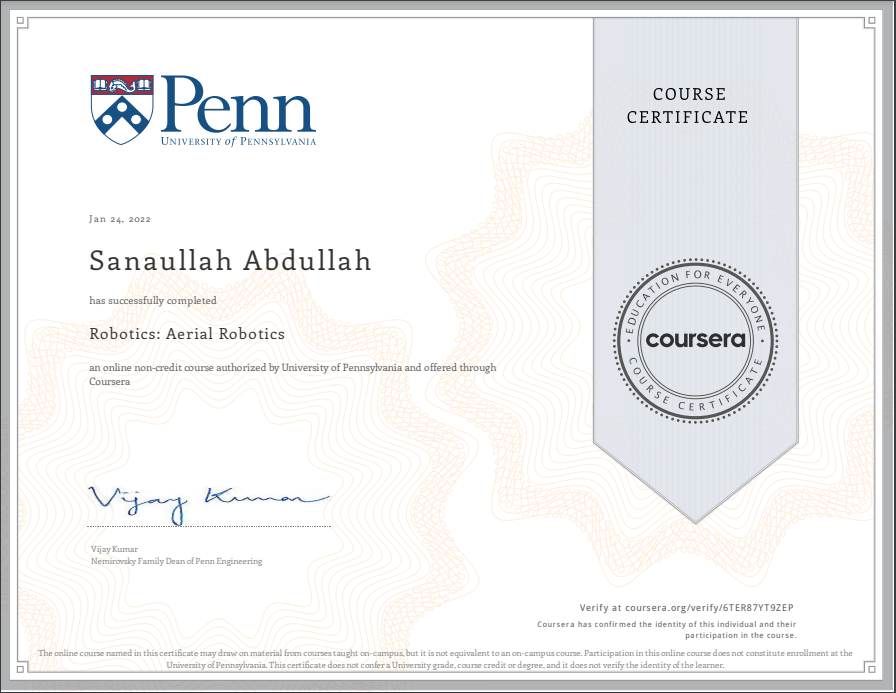

# 🚀 From Electrical Engineering to AI & Robotics – My Journey 

**Hi there! 👋 I'm Sanaullah**, a passionate **Master of Science in Computer Science** student specializing in **Artificial Intelligence**. My journey into AI and robotics began with an Electrical Engineering degree from Sukkur IBA University, where I developed a strong foundation in embedded systems and automation.

After graduating, I stepped into academia as a Robotics and AI Instructor for vocational training courses. This role sparked my curiosity about intelligent systems and their real-world applications. However, two key experiences fueled my transition into Computer Science:

- **📌 Teaching Vocational Courses in Robotics & AI –** While instructing students, I realised the immense potential of AI in shaping the future of automation, which deepened my interest in machine learning and intelligent systems.
  
- **📌 Research Associate at Sukkur IBA University –** My role as a research associate on an **AI-based Flood Alert Chatbot** introduced me to real-world AI applications, where I explored **natural language processing (NLP), machine learning, and data-driven decision-making**.

### 🎓 Education
- **Master of Science in Computer Science**
  - *Sukkur Iba University*
  - **Major Subjects**
  - *Advanced Natural Language Processing*
  - *Advance Machine Learning*
  - *Advance Computer Vision*
  
- **Bachelor of Electrical Engineering**
  - *Sukkur Iba University*
  - **Major Subjects**
  - *Fundamentals of Robotics*
  - *Introduction to Artificial Intelligence*
  - *Digital System Design*
  - *Programming Logic Control*
  - *Embedded System*

### 👨‍💻 Professional Experience
- **Visiting Faculty at Department of Computer System Engineering**
  - *Jan 2026 - Present*
  - As a VF, I am teaching:
    - Digital Signal Processing 
    - Machine Learning
    - Cybersecurity
      

- **Semester Exchange at Norwegian University of Science and Technology (NTNU)**
  - *Jan 2025 - June, 2025*
  - As a Research Associate, I worked on:
    - Plant Health Monitoring with Edge-AI 
    - Data Collection & Analysis
    - Training, Testing and Deployment of 19 different CNN-based Models on Edge Device
    - Performance Analysis 
    - Documentation
      
- **Research Associate | Sukkur IBA University**
  - *October 20, 2023 - March 18, 2025*
  - As a Research Associate, I worked on:
    - Literature Review
    - Data Collection & Analysis
    - Implementation and Development of an AI-based chatbot
    - Experimentation & Testing
    - Documentation

- **Robotics and AI Instructor | Sukkur IBA University**
  - *March 7, 2022 - September 6, 2022*
  - As a Robotics and AI Instructor, I:
    - Conducted classes on Robotics and Artificial Intelligence
    - Designed and delivered an engaging curriculum
    - Mentored and guided students in practical projects
    - Contributed to the development of educational materials
   
### Skills
  - *Deep Learning*
  - *Generative AI and Prompt Engineering*
  - *Agentic AI*
  - *Robot Operating System (ROS)*

### 🏆 Certificates

- **AI For Everyone**
  
  - *Issued by Coursera.org, authorised by deeplearning.ai*
  - *Date: March 2022*

- **Aerial Robotics**
  
  - *Issued by Coursera.org, authorised by the University of Pennsylvania*
  - *Date: January 2022*

- **Speak English Professionally: In Person, Online & On the Phone**
  
  - *Issued by Coursera.org, authorised by Georgia Institute of Technology*
  - *Date: March 2020*

- **Fundamentals of Network Communication**
  
  - *Issued by Coursera.org, authorised by the University of Colorado*
  - *Date: April 2020*

- **Introduction to Power Electronics**
  
  - *Issued by Coursera.org, authorised by the University of Colorado*
  - *Date: March 2020*

- **Social Psychology**
  
  - *Issued by Coursera.org, authorised by the University of Wesleyan*
  - *Date: May 2020*

### 🚀 Interests & Future Goals
I am particularly fascinated by:
- **💡 AI-driven automation**
- **🤖 Robotics & intelligent systems**
- **📊 Machine learning applications in real-world challenges**

### 🚀 Let's Connect
- **GitHub:** [github.com/Sanaullah-khaskheli](https://github.com/Sanaullah-khaskheli)
- **LinkedIn:** [linkedin.com/in/sanaullahkhaskheli](https://www.linkedin.com/in/sanaullahkhaskheli)
- **Email:** [skskhaskheli@gmail.com](mailto:skskhaskheli@gmail.com)

Feel free to explore my repositories and connect with me. I'm always open to collaborations, discussions, and learning from the amazing GitHub community.

Happy coding! 🚀
